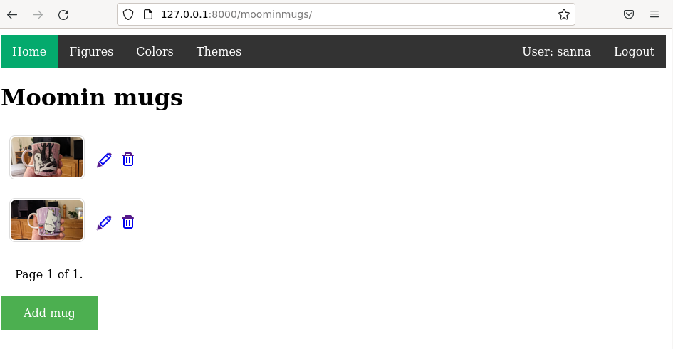
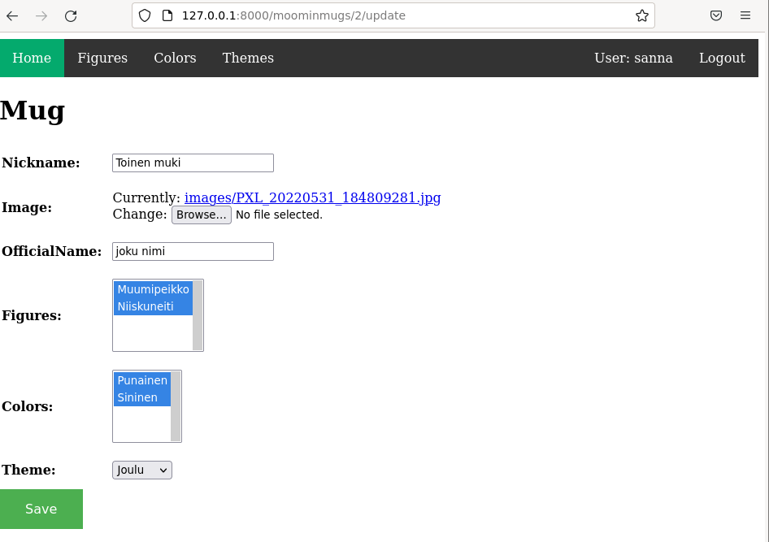

# MoominMugDjangoApp

<kbd></kbd>

<kbd></kbd>

# Linkki demoon

[http://jyrinki.com/moominmugs](http://jyrinki.com/moominmugs)

# Latauslinkki

[Latauslinkki](https://github.com/jyrinsan/MoominMugDjangoApp/archive/refs/heads/master.zip)

# Yleiskuvaus
MoominMug on Djangolla toteutettu webbisovellus, jossa voi webbiselaimella selata muumimukieni listaa, sekä lisätä, muokata ja poistaa mukeja. Kaikkeen tallentamiseen pitää olla kirjautunut käyttäjä, selailla voi ilman kirjautumista. Vain superuser(=minä) voi luoda uusia käyttäjiä admin-käyttöliittymältä.

## Projektin tarve
Sovelluksen tarve nousi siitä, että kerään muumimukeja, ja niitä on hyllyssä yli 60kpl. Kaupassa kun törmään johonkin ihanaan muumimukiin, en usein muista onko minulla se jo, kuinka ihanaa olisikaan katson kännykästä asia. Lisäksi äitini ja jotkut muut sukulaiset usein antavat minulle muumimukeja, mutteivat tietä mitä minulla jo on. Sovelluksella kaikki voisivat tarkistaa asian.

Haaga-Helian Python weppipalvelu - ideasta tuotantoon kurssin loppuprojekti

Sovelluksen tekijä: Sanna Jyrinki

Sovelluksen lisenssi: [GNU GENERAL PUBLIC LICENSE2](../LICENSE)

Sovelluksen vaihe: Beta

## Asennus kehityspalvelimelle

Kloonaa github repositoryni esim. kotihakemistoosi Linuxille
`git clone git@github.com:jyrinsan/MoominMugDjangoApp.git`

Projektin lataus ja virtuaaliympäristön luonti
```bash
cd ## siirry kotihakemistoosi Linuxissasi
git clone git@github.com:jyrinsan/MoominMugDjangoApp.git # vaatii, että olet määritellyt github ssh-avaimen
cd MoominMugDjangoApp
virtualenv --system-site-packages -p python3 env
source env/bin/activate
which pip # tarkastetaan, että polku env:n sisällä
```

Djangon asennus
```bash
micro requirements.txt 
# sisällöksi 
# django==3.2
# Pillow
pip install -r requirements.txt
django-admin --version # tarkistetaan asennus
```

Luo superuser
```bash
/manage.py createsuperuser
```

Käynnistä kehitysserveri 
```
./manage.py runserver
```

## Testaus

Kirjaudu luomallasi superuserilla sovelluksen admin-käyttöliittymään (tarkista ip kehitysserverin käynnistymisestä ja vaihda tarvittaessa 
```
http://127.0.0.1:8000/admin
```

Webbisovellukseen pääset
```
http://127.0.0.1:8000/moominmugs
```
